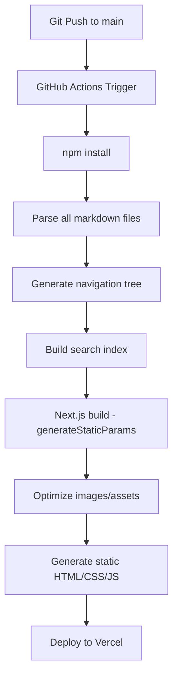

# Lightning Design System - Markdown-First Site Migration
## High-Level Design Document

**Version**: 1.0
**Date**: 2026-03-11
**Status**: Draft
**Author**: Clay Park, Salesforce Design Systems Engineering

---

## Executive Summary

This document outlines the migration of the Lightning Design System documentation site from a traditional CMS-based architecture (Payload CMS + PostgreSQL) to a **GitHub-native, markdown-first, agent-optimized** approach. The new architecture prioritizes:

- **Version control as source of truth**: All content lives in GitHub as markdown files
- **Agent-first authoring**: Optimized for AI agents to contribute via PRs
- **Hybrid editing**: Developers/agents use GitHub directly, designers use a custom web-based markdown editor
- **Static site generation**: 100% static HTML output for maximum performance
- **Minimal infrastructure**: Lightweight Heroku backend for the CMS editor only

---

## 1. Architecture Overview

### 1.1 System Components

```
┌─────────────────────────────────────────────────────────────┐
│                    GitHub Repository                         │
│  ┌────────────────────────────────────────────────────────┐ │
│  │  /content/                                             │ │
│  │    ├── foundations/                                    │ │
│  │    │   ├── colors.md                                   │ │
│  │    │   ├── typography.md                               │ │
│  │    │   └── spacing.md                                  │ │
│  │    ├── components/                                     │ │
│  │    │   ├── buttons/                                    │ │
│  │    │   │   ├── index.md                                │ │
│  │    │   │   ├── variants.md                             │ │
│  │    │   │   └── accessibility.md                        │ │
│  │    └── patterns/                                       │ │
│  │        └── ...                                         │ │
│  │  /public/assets/                                       │ │
│  │  /src/                                                 │ │
│  │    ├── app/                                            │ │
│  │    ├── components/                                     │ │
│  │    └── lib/markdown-parser.ts                          │ │
│  └────────────────────────────────────────────────────────┘ │
└──────────────────┬──────────────────────────────────────────┘
                   │
                   │ Pull Requests (Devs/Agents)
                   │ GitHub API (CMS Backend)
                   │
         ┌─────────┴─────────┐
         │                   │
         ▼                   ▼
┌─────────────────┐   ┌─────────────────────────┐
│  Developer CLI  │   │  Custom CMS Backend     │
│  - git commit   │   │  (Heroku)               │
│  - GitHub PR    │   │  ┌───────────────────┐  │
│  - Agent PR     │   │  │ Express.js API    │  │
└─────────────────┘   │  │ - Auth            │  │
                      │  │ - GitHub API SDK  │  │
                      │  │ - Session store   │  │
                      │  └───────────────────┘  │
                      │  ┌───────────────────┐  │
                      │  │ Web Editor UI     │  │
                      │  │ - Markdown editor │  │
                      │  │ - Component prev. │  │
                      │  │ - Nav manager     │  │
                      │  └───────────────────┘  │
                      └─────────────────────────┘
                                  │
                                  │ Auto-create PR
                                  ▼
                          GitHub Pull Request
                                  │
                                  │ Merge to main
                                  ▼
                      ┌─────────────────────────┐
                      │  GitHub Actions CI/CD   │
                      │  ┌───────────────────┐  │
                      │  │ 1. npm install    │  │
                      │  │ 2. npm run build  │  │
                      │  │ 3. Deploy to host │  │
                      │  └───────────────────┘  │
                      └─────────────────────────┘
                                  │
                                  ▼
                      ┌─────────────────────────┐
                      │  Static Site (Vercel)   │
                      │  - 100% static HTML     │
                      │  - Edge CDN             │
                      │  - Zero backend         │
                      └─────────────────────────┘
```

### 1.2 Key Design Principles

1. **GitHub as Single Source of Truth**: All content stored as markdown files in version control
2. **Static by Default**: Site is 100% pre-rendered, no runtime database queries
3. **Agent-Optimized**: Markdown format allows AI agents to easily contribute via PRs
4. **Hybrid Authoring**: Technical users commit directly, non-technical users use web CMS
5. **Pull Request Workflow**: All changes (including CMS edits) go through PR review
6. **Separation of Concerns**: CMS backend is isolated from the public site

---

## 2. Technology Stack

### 2.1 Public Site (Static)

| Component | Technology | Rationale |
|-----------|-----------|-----------|
| **Framework** | Next.js 15+ (App Router) | SSG with React, excellent DX, built-in optimizations |
| **Content Parser** | `remark` + `rehype` | Markdown → HTML with plugin ecosystem |
| **Styling** | Tailwind CSS v4 | Utility-first, matches SLDS design tokens |
| **Hosting** | Vercel | Zero-config Next.js deployment, edge network |
| **Search** | Pagefind or Algolia | Static search index or hosted search |
| **Component Demos** | Storybook embeds | Iframe-based component previews |

### 2.2 CMS Backend (Heroku)

| Component | Technology | Rationale |
|-----------|-----------|-----------|
| **Server** | Express.js (Node.js) | Lightweight, npm ecosystem, easy Heroku deployment |
| **Database** | PostgreSQL (Heroku addon) | User sessions, draft state, audit logs |
| **Auth** | Passport.js + Salesforce SSO | Enterprise auth, existing Salesforce identity |
| **GitHub Integration** | Octokit (GitHub API SDK) | Read/write markdown files, create PRs |
| **Session Store** | `connect-pg-simple` | PostgreSQL-backed sessions |
| **Markdown Editor** | Monaco Editor (VS Code) | Syntax highlighting, IntelliSense, familiar UX |
| **Component Previews** | React iframe sandbox | Live preview of SLDS components in markdown |

### 2.3 CI/CD

| Component | Technology | Rationale |
|-----------|-----------|-----------|
| **Build Pipeline** | GitHub Actions | Native GitHub integration, free for public repos |
| **Deployment** | Vercel GitHub integration | Auto-deploy on merge to main |
| **Asset Optimization** | `sharp` (image), `svgo` (SVG) | Optimize assets at build time |

---

## 3. Content Architecture

### 3.1 Directory Structure (GitHub Repo)

```
lightning-design-system/
├── content/                      # All markdown content
│   ├── get-started/
│   │   ├── index.md              # Category landing page
│   │   ├── installation.md
│   │   └── quick-start.md
│   ├── foundations/
│   │   ├── index.md
│   │   ├── colors/
│   │   │   ├── index.md
│   │   │   ├── palette.md
│   │   │   └── accessibility.md
│   │   ├── typography.md
│   │   └── spacing.md
│   ├── components/
│   │   ├── index.md
│   │   ├── buttons/
│   │   │   ├── index.md
│   │   │   ├── variants.md
│   │   │   ├── states.md
│   │   │   └── accessibility.md
│   │   └── input/
│   │       └── ...
│   ├── patterns/
│   │   └── ...
│   ├── accessibility/
│   │   └── ...
│   └── tools/
│       └── ...
├── public/
│   ├── assets/
│   │   ├── images/               # Hero images, screenshots
│   │   ├── videos/               # Video demos
│   │   └── downloads/            # Downloadable resources
│   └── favicon.ico
├── src/
│   ├── app/                      # Next.js app directory
│   │   ├── layout.tsx
│   │   ├── page.tsx              # Home page
│   │   ├── [category]/
│   │   │   └── [[...slug]]/      # Dynamic content pages
│   │   │       └── page.tsx
│   │   └── api/                  # Search API, etc.
│   ├── components/
│   │   ├── markdown/             # Custom markdown components
│   │   │   ├── Callout.tsx       # ::: callout :::
│   │   │   ├── ComponentDemo.tsx # ::: component-demo :::
│   │   │   └── CodeBlock.tsx     # ```language
│   │   ├── layout/
│   │   │   ├── Header.tsx
│   │   │   ├── Sidebar.tsx
│   │   │   └── Footer.tsx
│   │   └── search/
│   │       └── SearchBar.tsx
│   ├── lib/
│   │   ├── markdown.ts           # Markdown parser + plugins
│   │   ├── navigation.ts         # Auto-generate nav from file tree
│   │   ├── frontmatter.ts        # Parse YAML frontmatter
│   │   └── search-index.ts       # Generate search index at build
│   └── styles/
│       └── globals.css
├── cms-backend/                  # Separate CMS application (Heroku)
│   ├── src/
│   │   ├── server.ts             # Express server
│   │   ├── routes/
│   │   │   ├── auth.ts           # Salesforce SSO
│   │   │   ├── content.ts        # CRUD for markdown files
│   │   │   ├── navigation.ts     # Reorder pages
│   │   │   └── github.ts         # PR creation
│   │   ├── services/
│   │   │   ├── github-api.ts     # Octokit wrapper
│   │   │   └── markdown-validator.ts
│   │   └── middleware/
│   │       ├── auth.ts
│   │       └── error.ts
│   ├── public/                   # Static assets for CMS UI
│   │   └── editor/               # React SPA for markdown editor
│   ├── package.json
│   └── Procfile                  # Heroku config
├── .github/
│   └── workflows/
│       ├── deploy.yml            # Auto-deploy to Vercel
│       ├── build-preview.yml     # PR preview builds
│       └── validate-content.yml  # Lint markdown on PR
├── scripts/
│   ├── migrate-from-payload.ts   # One-time migration script
│   └── generate-nav.ts           # Generate navigation.json
├── package.json
├── next.config.ts
└── README.md
```

### 3.2 Markdown File Format

Each markdown file uses YAML frontmatter for metadata:

```markdown
---
title: Button Component
description: Buttons are used to trigger actions or events
category: components
subcategory: forms
order: 1
lastModified: 2026-03-11
author: Clay Park
status: published
seo:
  keywords: [button, component, form, action]
  ogImage: /assets/images/components/button-og.png
---

# Button Component

Buttons allow users to take actions with a single tap or click.

## Variants

### Primary Button

Primary buttons should be used for the main action on a page.

::: component-demo
storybook: https://storybook.example.com/iframe.html?id=button--primary
:::

::: callout type="info"
Use only one primary button per page for the main call-to-action.
:::

## Accessibility

All buttons must have accessible labels...
```

### 3.3 Custom Markdown Extensions

We'll extend standard markdown with custom directives for SLDS-specific features:

| Syntax | Purpose | Output |
|--------|---------|--------|
| `::: callout type="info"` | Info/warning/error boxes | Styled callout component |
| `::: component-demo storybook="..."` | Storybook embed | Iframe with component demo |
| `::: code-example language="html"` | Multi-tab code examples | Tabbed code blocks |
| `::: design-tokens category="color"` | Live design token table | Auto-generated token list |
| `{width=500 caption="..."}` | Enhanced images | Responsive image with caption |

---

## 4. Content Migration Plan

### 4.1 Current State (Payload CMS)

- **499 pages** in PostgreSQL database
- **9,054 content blocks** (heading, paragraph, list, html, callout, image, code)
- **8 categories** with nested navigation
- **362 media assets** in `/public/media/`

### 4.2 Migration Approach: Manual Page-by-Page

**Rationale**: Manual migration allows for:
- Content cleanup and modernization
- Fixing known data issues (e.g., Styling Hooks page)
- Simplifying complex layouts
- Optimizing for markdown format
- Establishing patterns for new content

**Process**:

1. **Phase 1: Infrastructure Setup** (Weeks 1-2)
   - Set up GitHub repo with directory structure
   - Build markdown parser with custom extensions
   - Create Next.js static site shell
   - Deploy basic site to Vercel

2. **Phase 2: Core Pages Migration** (Weeks 3-4)
   - Migrate 20 most-visited pages first (Analytics-driven)
   - Establish markdown patterns and conventions
   - Create reusable markdown templates
   - Document migration guidelines

3. **Phase 3: Bulk Migration** (Weeks 5-8)
   - Migrate remaining 479 pages
   - Allocate 30-60 min per page
   - Prioritize by category (Components > Foundations > Patterns)
   - Run parallel workstreams (multiple contributors)

4. **Phase 4: CMS Backend** (Weeks 6-8, parallel)
   - Build Express.js backend on Heroku
   - Implement Salesforce SSO auth
   - Create markdown editor UI
   - GitHub API integration for PR creation

5. **Phase 5: Polish & Launch** (Weeks 9-10)
   - Search implementation
   - SEO optimization
   - Performance audit
   - Redirect rules from old URLs
   - Soft launch and feedback

### 4.3 Migration Tooling

While migration is manual, we'll build helper scripts:

```typescript
// scripts/migrate-from-payload.ts
// Exports Payload page as markdown template for manual editing

async function exportPageAsMarkdown(pageSlug: string) {
  const page = await payload.findOne({ collection: 'pages', where: { slug: { equals: pageSlug }}})

  const frontmatter = {
    title: page.title,
    category: page.category.slug,
    order: page.order,
    lastModified: page.updatedAt,
    status: 'draft'
  }

  let markdown = `---\n${yaml.stringify(frontmatter)}---\n\n`

  for (const block of page.layout) {
    markdown += convertBlockToMarkdown(block)
  }

  const filepath = `content/${page.category.slug}/${page.slug}.md`
  await fs.writeFile(filepath, markdown)

  console.log(`Exported ${filepath} (needs manual review)`)
}
```

---

## 5. CMS Backend Design

### 5.1 Architecture (Heroku)

```
┌─────────────────────────────────────────────────────────┐
│  CMS Backend (Heroku)                                   │
│  ┌───────────────────────────────────────────────────┐ │
│  │  Express.js Server (Node.js)                      │ │
│  │  ┌─────────────────────────────────────────────┐  │ │
│  │  │  Routes                                      │  │ │
│  │  │  - POST /auth/salesforce                     │  │ │
│  │  │  - GET  /api/content/:path                   │  │ │
│  │  │  - PUT  /api/content/:path                   │  │ │
│  │  │  - POST /api/github/create-pr                │  │ │
│  │  │  - GET  /api/navigation                      │  │ │
│  │  │  - PUT  /api/navigation                      │  │ │
│  │  └─────────────────────────────────────────────┘  │ │
│  │  ┌─────────────────────────────────────────────┐  │ │
│  │  │  Services                                    │  │ │
│  │  │  - GitHubService (Octokit)                   │  │ │
│  │  │  - MarkdownValidator                         │  │ │
│  │  │  - NavigationService                         │  │ │
│  │  └─────────────────────────────────────────────┘  │ │
│  └───────────────────────────────────────────────────┘ │
│  ┌───────────────────────────────────────────────────┐ │
│  │  PostgreSQL (Heroku Postgres)                     │ │
│  │  - users (Salesforce ID, role, name, email)      │ │
│  │  - sessions (express-session store)              │ │
│  │  - audit_log (user, action, file, timestamp)     │ │
│  │  - drafts (user, file_path, markdown, updated)   │ │
│  └───────────────────────────────────────────────────┘ │
└─────────────────────────────────────────────────────────┘
                    │
                    │ HTTPS
                    ▼
┌─────────────────────────────────────────────────────────┐
│  CMS Frontend (React SPA)                               │
│  - Monaco Editor with markdown syntax highlighting      │
│  - Live preview pane (remark → HTML)                    │
│  - Component palette (insert callouts, demos, etc.)     │
│  - Navigation tree editor (drag-drop reorder)           │
│  - "Create PR" button → opens PR on GitHub              │
└─────────────────────────────────────────────────────────┘
```

### 5.2 Key Features

1. **Authentication**
   - Salesforce SSO (OAuth 2.0)
   - Role-based access control (Admin, Editor, Viewer)
   - Session-based auth with PostgreSQL store

2. **Markdown Editor**
   - Monaco Editor (VS Code engine)
   - Split-pane: markdown source | live preview
   - Syntax highlighting for custom directives
   - Component insertion palette
   - Auto-save to drafts table

3. **File Locking (Collaboration Control)**
   - Single-user editing: lock file when user opens it
   - Display lock status: "Editing by [User Name] since [Time]"
   - Auto-release lock after 30 minutes of inactivity
   - Manual release on "Close" or "Publish"
   - Lock table in PostgreSQL: `file_locks (file_path, user_id, locked_at)`

4. **GitHub Integration**
   - Read file from GitHub API
   - Edit in draft state (PostgreSQL)
   - "Publish" button → Create PR with changes
   - PR description auto-generated from commit message
   - Link to PR for tracking

5. **Navigation Manager**
   - Visual tree editor for reordering pages
   - Drag-and-drop interface
   - Saves to `content/_navigation.json`
   - Commits to GitHub via PR

6. **Asset Management**
   - Upload images to `/public/assets/images/`
   - Commit directly to GitHub repo (no CDN)
   - Image optimization (compress, resize via sharp)
   - Generate responsive srcset

### 5.3 Security

- **Heroku-hosted**: Isolated from public site
- **Salesforce SSO**: Enterprise-grade authentication
- **GitHub App**: Scoped permissions (read/write content, create PRs)
- **Rate limiting**: Prevent API abuse
- **Input validation**: Sanitize markdown, validate frontmatter
- **Audit log**: Track all changes (user, timestamp, file, action)

---

## 6. Static Site Generation

### 6.1 Build Process



### 6.2 Navigation Generation

Navigation is auto-generated from directory structure + frontmatter:

```typescript
// lib/navigation.ts
import fs from 'fs'
import path from 'path'
import matter from 'gray-matter'

export function generateNavigation(contentDir: string) {
  const categories = fs.readdirSync(contentDir, { withFileTypes: true })
    .filter(dirent => dirent.isDirectory())
    .map(dirent => {
      const categoryPath = path.join(contentDir, dirent.name)
      const indexFile = path.join(categoryPath, 'index.md')
      const indexData = matter(fs.readFileSync(indexFile, 'utf-8'))

      return {
        slug: dirent.name,
        title: indexData.data.title,
        order: indexData.data.order || 999,
        children: getChildren(categoryPath)
      }
    })
    .sort((a, b) => a.order - b.order)

  return categories
}

function getChildren(dir: string): NavItem[] {
  // Recursively parse directory, respecting frontmatter order
  // ...
}
```

### 6.3 Markdown Processing Pipeline

```typescript
// lib/markdown.ts
import { unified } from 'unified'
import remarkParse from 'remark-parse'
import remarkGfm from 'remark-gfm'
import remarkDirective from 'remark-directive'
import remarkRehype from 'remark-rehype'
import rehypeHighlight from 'rehype-highlight'
import rehypeStringify from 'rehype-stringify'
import { visit } from 'unist-util-visit'

export async function parseMarkdown(markdown: string): Promise<string> {
  const result = await unified()
    .use(remarkParse)
    .use(remarkGfm)
    .use(remarkDirective)
    .use(customDirectives) // Transform ::: callout ::: → React components
    .use(remarkRehype, { allowDangerousHtml: true })
    .use(rehypeHighlight)
    .use(rehypeStringify, { allowDangerousHtml: true })
    .process(markdown)

  return String(result)
}

function customDirectives() {
  return (tree: any) => {
    visit(tree, (node) => {
      if (node.type === 'containerDirective' && node.name === 'callout') {
        const data = node.data || (node.data = {})
        data.hName = 'div'
        data.hProperties = {
          className: `callout callout-${node.attributes.type || 'info'}`
        }
      }
      // Handle other custom directives...
    })
  }
}
```

---

## 7. Agent Optimization

### 7.1 Why This Architecture is Agent-First

1. **Markdown is AI-native**: LLMs understand markdown structure perfectly
2. **Git workflow**: Agents can create PRs just like human developers
3. **File-based**: Simple CRUD operations, no database queries
4. **Validation via CI**: GitHub Actions run linters/tests on agent PRs
5. **Review by humans**: All agent changes go through PR review

### 7.2 Agent Contribution Workflow

```bash
# Agent (Claude Code, GitHub Copilot, etc.) workflow

# 1. Clone repo
git clone https://github.com/salesforce-ux/lightning-design-system.git
cd lightning-design-system

# 2. Create feature branch
git checkout -b docs/update-button-accessibility

# 3. Edit markdown file
code content/components/buttons/accessibility.md

# 4. Validate locally
npm run lint:markdown
npm run build

# 5. Commit and push
git add content/components/buttons/accessibility.md
git commit -m "docs: improve button accessibility guidelines

- Added WCAG 2.1 Level AA compliance details
- Included keyboard navigation examples
- Updated screen reader guidelines"

git push origin docs/update-button-accessibility

# 6. Create PR via GitHub API
gh pr create --title "docs: improve button accessibility guidelines" \
  --body "Enhances accessibility documentation for button component..."
```

### 7.3 AI-Friendly Markdown Conventions

- **Consistent heading hierarchy**: Always start with `#` (h1), increment logically
- **Explicit link text**: `[Button component](./buttons/index.md)` not `[here](./buttons/index.md)`
- **Alt text on all images**: ``
- **Semantic HTML in tables**: Use markdown tables, avoid raw HTML when possible
- **Clear custom directive syntax**: `::: callout type="warning"` not `:::callout:::`

---

## 8. Implementation Phases (1-Month Sprint)

**Team Size**: 4-6 people (2 backend/CMS, 3-4 content migration)
**Timeline**: 4 weeks (aggressive, full-time commitment)

### Week 1: Foundation + Core Pages

**Goals**:
- Set up infrastructure
- Migrate first 50 high-priority pages
- Establish content patterns

**Workstreams**:

**Stream A (Backend Engineers x2)**:
- [ ] GitHub repo setup with directory structure
- [ ] Next.js project with app router + Tailwind
- [ ] Markdown parser with custom directives (callout, component-demo, code-example)
- [ ] Basic layout components (Header, Sidebar, Footer)
- [ ] Navigation auto-generation from file tree
- [ ] Deploy to Vercel (CI/CD pipeline)
- [ ] Start CMS backend: Express.js server scaffold, PostgreSQL setup

**Stream B (Content Engineers x3-4)**:
- [ ] Export Payload pages to markdown templates (script)
- [ ] Migrate top 50 pages (Components category priority)
- [ ] Create markdown style guide
- [ ] Document custom directive usage patterns
- [ ] Migrate hero images and critical assets

**Deliverables**: Live site with 50 pages, CMS backend skeleton

---

### Week 2: CMS Backend + Bulk Migration

**Goals**:
- Complete CMS backend core features
- Migrate 200 more pages (250 total)

**Workstreams**:

**Stream A (Backend Engineers x2)**:
- [ ] Salesforce SSO authentication (OAuth 2.0)
- [ ] Monaco Editor integration (split-pane editor + preview)
- [ ] GitHub API integration (Octokit: read/write files)
- [ ] File locking system (PostgreSQL-backed)
- [ ] Draft autosave functionality
- [ ] "Create PR" endpoint
- [ ] Deploy CMS to Heroku

**Stream B (Content Engineers x3-4)**:
- [ ] Migrate 200 additional pages
- [ ] Foundations category (complete)
- [ ] Components category (80% complete)
- [ ] Asset optimization and migration
- [ ] Cross-linking between pages

**Deliverables**: Functional CMS backend, 250 pages migrated

---

### Week 3: Polish + Bulk Migration Completion

**Goals**:
- Complete content migration
- Add search and polish features

**Workstreams**:

**Stream A (Backend Engineers x1, Frontend Engineer x1)**:
- [ ] Navigation manager UI (drag-drop reorder)
- [ ] Asset upload UI in CMS
- [ ] Search implementation (Pagefind)
- [ ] SEO metadata generation
- [ ] Performance optimization pass
- [ ] Accessibility audit

**Stream B (Content Engineers x3-4)**:
- [ ] Migrate remaining 249 pages (all 499 complete)
- [ ] Patterns category (complete)
- [ ] Accessibility category (complete)
- [ ] Tools category (complete)
- [ ] Final content QA pass
- [ ] Fix broken links and missing assets

**Deliverables**: All 499 pages migrated, search working, CMS feature-complete

---

### Week 4: Launch Prep + Soft Launch

**Goals**:
- Final QA, testing, documentation
- Soft launch and monitoring

**Workstreams**:

**Full Team (All hands)**:
- [ ] End-to-end testing (frontend + CMS)
- [ ] User acceptance testing with designers
- [ ] CMS user training documentation
- [ ] Agent contribution guide (GitHub workflow)
- [ ] 301 redirect rules from old URLs
- [ ] Performance audit (Lighthouse score 95+)
- [ ] Accessibility compliance check (WCAG AA)
- [ ] Sitemap and robots.txt
- [ ] Analytics and monitoring setup
- [ ] Soft launch to internal users
- [ ] Collect feedback and fix critical bugs
- [ ] Public launch (end of week 4)

**Deliverables**: Production-ready site, CMS in use, documentation complete

---

### Roles & Responsibilities

| Role | Count | Responsibilities |
|------|-------|------------------|
| **Backend Engineer** | 2 | CMS backend (Express.js, GitHub API, auth), Heroku deployment |
| **Frontend Engineer** | 1 | Next.js site, markdown parser, search, performance optimization |
| **Content Engineers** | 3-4 | Page migration, markdown authoring, asset management, QA |
| **Project Lead (Clay)** | 1 | Architecture, unblocking, stakeholder communication, final reviews |

---

## 9. Success Metrics

| Metric | Current (Payload CMS) | Target (Markdown) |
|--------|----------------------|-------------------|
| **Build Time** | 45s | <30s |
| **Lighthouse Performance** | 85 | 95+ |
| **First Contentful Paint** | 1.2s | <0.8s |
| **Time to Interactive** | 2.5s | <1.5s |
| **Agent PR Success Rate** | N/A | >90% (auto-merge rate) |
| **CMS User Satisfaction** | 6/10 (assumed) | 8/10 |
| **Content Update Time** | 5 min (DB save) | 2 min (PR creation) |
| **Infrastructure Cost** | $150/mo (Payload+DB+host) | $50/mo (Heroku CMS only) |

---

## 10. Risks & Mitigations

| Risk | Impact | Probability | Mitigation |
|------|--------|-------------|------------|
| **Manual migration takes longer than 10 weeks** | High | Medium | Add more contributors, simplify complex pages, use migration scripts for boilerplate |
| **CMS backend not ready when needed** | Medium | Low | Designers can wait for CMS; devs use GitHub directly in interim |
| **Markdown limitations for complex layouts** | Medium | Medium | Use HTML in markdown sparingly, create custom directives for common patterns |
| **GitHub API rate limits** | Low | Low | Use GitHub App with higher limits, implement caching in CMS backend |
| **Loss of Payload CMS features** | Medium | High | Document workarounds, implement must-have features in CMS backend |
| **SEO regression during migration** | High | Medium | Maintain URL structure, implement 301 redirects, test with Google Search Console |

---

## 11. Design Decisions

### Resolved:

1. **Asset Storage**: ✅ Store in GitHub repo (`/public/assets/`) - Simple, version-controlled, sufficient for current asset size
2. **Component Demos**: ✅ Keep existing Storybook iframe embeds via `::: component-demo :::` directive
3. **CMS Collaboration**: ✅ Single-user editing with file locking - Prevents conflicts, simple implementation
4. **Timeline**: ✅ 1 month with full team (4-6 people) - Aggressive but achievable with dedicated resources

### Open Questions:

1. **Search Provider**: Pagefind (free, static) vs Algolia (paid, hosted)?
2. **CMS UI Framework**: Plain React SPA vs Next.js for CMS frontend?
3. **Versioning**: Should we support multiple versions of docs (e.g., v2.x, v3.x)?
4. **Internationalization**: Plan for multi-language support in the future?

---

## 12. Appendix

### A. Example Markdown Page

```markdown
---
title: Button Component
description: Buttons allow users to take actions with a single tap or click
category: components
subcategory: forms
order: 5
lastModified: 2026-03-11
author: Clay Park
status: published
seo:
  title: Button Component - Lightning Design System
  description: Learn how to use button components in your Salesforce applications
  keywords: [button, component, cta, action, form]
  ogImage: /assets/images/components/button-og.png
related:
  - /components/input
  - /patterns/forms
  - /accessibility/keyboard-navigation
---

# Button Component

Buttons are used to trigger actions or events. They should have clear, concise labels that describe the action they perform.

::: callout type="info"
Use only one primary button per page or section to indicate the main call-to-action.
:::

## Variants

### Primary Button

The primary button is used for the main action on a page.

::: component-demo
storybook: https://lightningdesignsystem.com/storybook/iframe.html?id=button--primary
title: Primary Button Demo
height: 200
:::

```html
<button class="slds-button slds-button_brand">
  Primary Button
</button>
```

### Secondary Button

Secondary buttons are used for less important actions.

{width=600 caption="Secondary button states"}

## Accessibility

All buttons must meet WCAG 2.1 Level AA requirements:

- Minimum touch target size: 44x44px
- Color contrast ratio: 4.5:1 for text, 3:1 for visual indicators
- Keyboard accessible: Must be focusable and activatable with Enter/Space
- Screen reader support: Use `aria-label` for icon-only buttons

::: callout type="warning"
Never use `<div>` or `<span>` styled as buttons. Always use semantic `<button>` or `<a>` elements.
:::

## Design Tokens

| Token | Value | Usage |
|-------|-------|-------|
| `$button-color-background-primary` | `#0176d3` | Primary button background |
| `$button-color-border` | `#0176d3` | Button border color |
| `$button-spacing-padding` | `0.5rem 1rem` | Button padding |

::: design-tokens category="button" :::

## Related

- [Input Component](/components/input)
- [Form Patterns](/patterns/forms)
- [Keyboard Navigation](/accessibility/keyboard-navigation)
```

### B. GitHub Actions Workflow

```yaml
# .github/workflows/deploy.yml
name: Deploy to Vercel

on:
  push:
    branches: [main]
  pull_request:
    branches: [main]

jobs:
  build-and-deploy:
    runs-on: ubuntu-latest
    steps:
      - uses: actions/checkout@v4

      - name: Setup Node.js
        uses: actions/setup-node@v4
        with:
          node-version: '20'
          cache: 'npm'

      - name: Install dependencies
        run: npm ci

      - name: Lint markdown
        run: npm run lint:markdown

      - name: Build site
        run: npm run build

      - name: Run tests
        run: npm test

      - name: Deploy to Vercel (main branch only)
        if: github.ref == 'refs/heads/main'
        uses: amondnet/vercel-action@v20
        with:
          vercel-token: ${{ secrets.VERCEL_TOKEN }}
          vercel-org-id: ${{ secrets.VERCEL_ORG_ID }}
          vercel-project-id: ${{ secrets.VERCEL_PROJECT_ID }}
          vercel-args: '--prod'
```

### C. CMS Backend API Routes

```typescript
// cms-backend/src/routes/content.ts
import express from 'express'
import { GitHubService } from '../services/github-api'
import { requireAuth } from '../middleware/auth'

const router = express.Router()
const github = new GitHubService()

// Get file content from GitHub
router.get('/api/content/:path(*)', requireAuth, async (req, res) => {
  const filePath = `content/${req.params.path}`
  const content = await github.getFile(filePath)
  res.json({ content, path: filePath })
})

// Save draft (PostgreSQL, not committed yet)
router.put('/api/content/:path(*)/draft', requireAuth, async (req, res) => {
  const { markdown } = req.body
  await req.db.query(
    'INSERT INTO drafts (user_id, file_path, markdown, updated_at) VALUES ($1, $2, $3, NOW()) ON CONFLICT (user_id, file_path) DO UPDATE SET markdown = $3, updated_at = NOW()',
    [req.user.id, req.params.path, markdown]
  )
  res.json({ success: true })
})

// Publish: create PR on GitHub
router.post('/api/content/:path(*)/publish', requireAuth, async (req, res) => {
  const { markdown, commitMessage } = req.body
  const filePath = `content/${req.params.path}`

  // Create branch, commit file, open PR
  const pr = await github.createPR({
    branch: `cms-edit-${Date.now()}`,
    filePath,
    content: markdown,
    commitMessage,
    prTitle: commitMessage,
    prBody: `Edited via CMS by ${req.user.name}`
  })

  // Log audit trail
  await req.db.query(
    'INSERT INTO audit_log (user_id, action, file_path, pr_url, created_at) VALUES ($1, $2, $3, $4, NOW())',
    [req.user.id, 'publish', filePath, pr.html_url]
  )

  res.json({ success: true, prUrl: pr.html_url })
})

export default router
```

---

## 13. Next Steps

1. **Review this HLD** with stakeholders (Design Systems team, Engineering, Marketing)
2. **Answer open questions** (Section 11)
3. **Create sprint plan** with detailed tasks and assignments
4. **Set up GitHub repository** with initial structure
5. **Kick off Phase 1** (Foundation)

---

**Document Status**: Ready for review
**Last Updated**: 2026-03-11
**Next Review**: After stakeholder feedback
